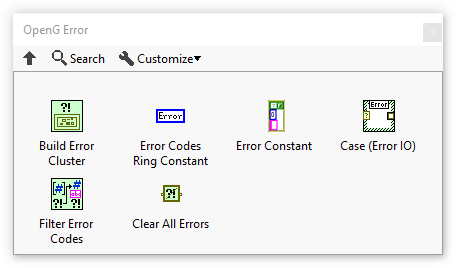

# OpenG Error Library

  

The OpenG Error Library package contains several routines related to error handling.

[Install the OpenG Error Library with VIPM](https://www.vipm.io/package/oglib_error/)

## Overview

### Functions Palette

The OpenG Error Library provides a set of VIs that can be used to create and manipulate error clusters. The library includes VIs for creating error clusters, extracting error information, clearing errors, and more.

Many of these VIs are similar to the error handling VIs that ship with LabVIEW, since the OpenG library has been around for more than 20 years (and many LabVIEW features were inspired by OpenG)!

## Contributors

<!-- ALL-CONTRIBUTORS-LIST:START - Do not remove or modify this section -->
<!-- prettier-ignore-start -->
<!-- markdownlint-disable -->
<table>
  <tbody>
    <tr>
      <td align="center" valign="top" width="14.28%"><a href="https://github.com/tmaila"> <b>Tomi Maila</b></a> <a href="#code-tmaila" title="Code">💻</a></td>
      <td align="center" valign="top" width="14.28%"><a href="https://github.com/tcplomp"> <b>tcplomp</b></a> <a href="#code-tcplomp" title="Code">💻</a> <a href="#maintenance-tcplomp" title="Maintenance">🚧</a></td>
      <td align="center" valign="top" width="14.28%"><a href="https://github.com/philippe-guerit"> <b>philippe-guerit</b></a> <a href="#code-philippe-guerit" title="Code">💻</a></td>
      <td align="center" valign="top" width="14.28%"><a href="https://github.com/justingoeres"> <b>Justin Goeres</b></a> <a href="#code-justingoeres" title="Code">💻</a></td>
    </tr>
  </tbody>
</table>

<!-- markdownlint-restore -->
<!-- prettier-ignore-end -->

<!-- ALL-CONTRIBUTORS-LIST:END -->

